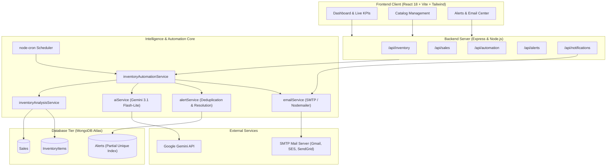

# SyncThreshold

> **Autonomous AI-Powered Inventory Intelligence, Stockout Risk Forecasting & Reorder Automation Platform**

[](file:///home/swarnavo/Desktop/PROJECTS/SyncThreshold/server/src/scripts/testSuite.js)
[](https://nodejs.org/)
[](https://react.dev/)
[](https://www.mongodb.com/)
[](https://ai.google.dev/)
[](https://nodemailer.com/)
[](https://github.com/node-cron/node-cron)
[](file:///home/swarnavo/Desktop/PROJECTS/SyncThreshold/LICENSE.md)

---

## Executive Overview

**SyncThreshold** is an autonomous inventory intelligence and reorder platform designed to eliminate stockouts, overstocking, and manual replenishment guesswork.

By unifying **deterministic mathematical burn-rate modeling** with **generative Google Gemini AI contextual reasoning**, **continuous background cron auditing**, **database-tier duplicate alert prevention**, and **automated multi-channel SMTP notifications**, SyncThreshold delivers an end-to-end operational pipeline that keeps warehouses, retail catalogs, and procurement teams continuously synchronized.

```
       [ Point of Sale Transactions ]
                     │
                     ▼
  ┌─────────────────────────────────────┐
  │  Deterministic Intelligence Engine  │ ──► Sales Velocity & Days-to-Stockout
  └─────────────────────────────────────┘
                     │
                     ▼ (Filters out Healthy SKUs)
  ┌─────────────────────────────────────┐
  │      Google Gemini AI Service       │ ──► Contextual Urgency & Reorder Actions
  └─────────────────────────────────────┘     (with Automatic Deterministic Fallback)
                     │
                     ▼
  ┌─────────────────────────────────────┐
  │     Alerts & Deduplication Layer    │ ──► Partial Unique Compound Index
  └─────────────────────────────────────┘     (Auto-resolves on restock)
                     │
                     ▼
  ┌─────────────────────────────────────┐
  │      SMTP Notification Service      │ ──► Formatted HTML/Plaintext Advisory
  └─────────────────────────────────────┘     (Deduplicated to prevent inbox spam)
                     │
                     ▼
  ┌─────────────────────────────────────┐
  │    Reactive Real-Time Dashboard     │ ──► React 18 + Vite + Tailwind CSS
  └─────────────────────────────────────┘
```

---

## Core Capabilities

### ⚡ Deterministic Sales Velocity & Runway Engine

- **Accurate Burn Rates**: Calculates true sales velocity ($v = \frac{\text{units sold}}{\text{analysis days}}$) across configurable historical analysis windows (7d, 14d, 30d).
- **Exact Stockout Runway**: Projects exact days until stockout ($R = \frac{\text{current stock}}{\text{sales velocity}}$).
- **Zero Hallucination**: Mathematical baseline computations ensure business logic never relies on ungrounded AI guesses.
- **Categorical Risk Tagging**: Classifies catalog items into `HEALTHY`, `LOW_STOCK`, and `STOCKOUT_RISK`.

### 🤖 Google Gemini AI Contextual Reasoning

- **Model Integration**: Powered by `@google/genai` using Google's lightweight, high-performance `gemini-3.1-flash-lite`.
- **Structured Decision Contracts**: Returns strict JSON schemas containing:
  - **Urgency Levels**: `LOW`, `MEDIUM`, `HIGH`, `CRITICAL`
  - **Action Directives**: `MONITOR`, `PLAN_REORDER`, `REORDER_SOON`, `REORDER_NOW`
  - **Business Rationale**: Contextual, human-readable justification summarizing burn rate velocity and inventory buffer health.
- **Rate-Limiting & Quota Pacing**: Integrated request pacing delay (`GEMINI_REQUEST_DELAY_MS`) and exponential backoff retry on HTTP 429 quota exhaustion.
- **100% Deterministic Fallback**: If the Gemini API key is missing, network is unavailable, or billing quotas are exceeded, the engine falls back instantly to deterministic heuristics without interrupting workflow execution.

### ⏱️ Autonomous Background Monitoring (node-cron)

- **Continuous Auditing**: Autonomous scheduler running on user-defined cron expressions (default: `*/15 * * * *`).
- **Concurrency Mutex Locking**: In-memory single-process lock guarantees that overlapping audits never run concurrently. Conflicting HTTP trigger requests receive `409 Conflict`.
- **Token-Optimized Candidate Selection**: Filters out `HEALTHY` items prior to AI analysis, reducing Gemini token overhead by up to 90%.
- **Product-Level Fault Tolerance**: Errors during an individual SKU analysis are isolated and logged without crashing or aborting the overall audit batch.

### 🛡️ Persistent Alert Lifecycle & Database Deduplication

- **MongoDB Unique Partial Indexing**: Enforces uniqueness on `(inventoryItemId, alertType)` exclusively for `status = "ACTIVE"`.
- **Concurrency Race Protection**: Gracefully catches MongoDB duplicate-key errors (`E11000`) and returns the active alert seamlessly.
- **Automated Alert Resolution**: Background monitors inspect active alerts and automatically transition them to `RESOLVED` with a `resolvedAt` timestamp once inventory levels recover above reorder thresholds.

### 📧 Transactional SMTP Email Notifications

- **Automated Risk Dispatch**: Sends rich HTML and plain-text emails to procurement staff immediately when newly created active alerts emerge.
- **Intelligent Deduplication**: Reused active alerts in subsequent audit cycles are automatically filtered out to prevent mailbox spam.
- **Isolated Service Architecture**: All email logic is encapsulated within `emailService.js`; database models and schedulers remain decoupled.
- **Interactive Control**: On-demand test email trigger and single-click manual dispatch for individual alerts or batch pending alerts directly from the dashboard.

### 📊 Modern Real-Time Dashboard

- **Executive KPI Cards**: Real-time counters for Total SKUs, Aggregate Sales Revenue, Reorder Required items, and Inventory Valuation.
- **Interactive Inventory Management**: Live searchable and filterable table with full CRUD modals and stock indicators.
- **Point-of-Sale (POS) Integration**: Modal to record sales transactions with atomic stock decrements.
- **Background Monitor Widget**: Live scheduler state, last run duration, items checked, and trigger button.
- **Email Settings & Alerts Center**: Live SMTP status, test email button, pending dispatch action, and active alert feeds with manual email trigger buttons.

---

## Tech Stack

| Layer                       | Technologies                                            |
| --------------------------- | ------------------------------------------------------- |
| **Frontend UI**             | React 18, Vite 5, Tailwind CSS, Lucide React, Axios     |
| **Backend API**             | Node.js (v24 LTS), Express.js, Mongoose 8               |
| **Artificial Intelligence** | Google Gemini 3.1 Flash-Lite (`@google/genai`)          |
| **Database**                | MongoDB Atlas (or local MongoDB 6+)                     |
| **Scheduling**              | node-cron                                               |
| **Notifications**           | SMTP via Nodemailer                                     |
| **Test Suite**              | Node.js native test runner (`node:test`, `node:assert`) |

---

## System Architecture



---

## Quickstart Guide

### 1. Prerequisites

- **Node.js**: `v18.0.0` or higher (tested on `v24.14.0`)
- **npm**: `v9.0.0` or higher
- **MongoDB**: Active MongoDB Atlas connection URI or local MongoDB daemon
- **Google Gemini API Key**: Free or paid key from [Google AI Studio](https://aistudio.google.com/)
- **SMTP Account**: Gmail (App Password), Amazon SES, SendGrid, or any standard SMTP service

### 2. Clone & Install Dependencies

```bash
git clone https://github.com/your-org/SyncThreshold.git
cd SyncThreshold

# Install both backend and frontend dependencies in one command
npm run install:all
```

### 3. Environment Configuration

Create a `.env` file in the `server/` directory (or copy from `server/.env.example`):

```env
# Server Port & Database
PORT=5000
MONGODB_URI=mongodb+srv://<user>:<password>@cluster.mongodb.net/inventory_db?retryWrites=true&w=majority

# Inventory Intelligence & Lookback Windows
SALES_ANALYSIS_DAYS=7
STOCKOUT_WARNING_DAYS=7

# Google Gemini AI Configuration
GEMINI_API_KEY=your_gemini_api_key_here
GEMINI_MODEL=gemini-3.1-flash-lite
AI_ENABLED=true
GEMINI_REQUEST_DELAY_MS=1500

# Automated Background Monitoring (node-cron)
AUTOMATION_ENABLED=true
INVENTORY_CHECK_CRON=*/15 * * * *

# Email Notifications Configuration (SMTP)
EMAIL_ENABLED=true
SMTP_HOST=smtp.gmail.com
SMTP_PORT=587
SMTP_USER=your_email@gmail.com
SMTP_PASSWORD=your_gmail_app_password
ALERT_EMAIL_FROM=alerts@syncthreshold.local
ALERT_EMAIL_TO=operations@syncthreshold.local

# Client API Target
VITE_API_URL=http://localhost:5000/api
```

> **Gmail SMTP Setup**: When using `smtp.gmail.com`, generate a 16-character **App Password** via Google Account Security > 2-Step Verification > App Passwords.

### 4. Seed Initial Catalog & Sales Data

Populate your database with realistic inventory items (Healthy, Low Stock, Critical) and historical sales transactions:

```bash
npm run seed
```

### 5. Launch Development Environment

Run both backend API and frontend client concurrently:

```bash
# Terminal 1: Backend API Server (http://localhost:5000)
npm run dev:server

# Terminal 2: React + Vite Frontend (http://localhost:5173)
npm run dev:client
```

Open your browser at **`http://localhost:5173`** to access the dashboard.

---

## Configuration Reference

| Variable                  | Type    | Default                      | Description                                                 |
| ------------------------- | ------- | ---------------------------- | ----------------------------------------------------------- |
| `PORT`                    | Number  | `5000`                       | Port for Express API backend                                |
| `MONGODB_URI`             | String  | _Required_                   | MongoDB connection string (Atlas or local)                  |
| `SALES_ANALYSIS_DAYS`     | Number  | `7`                          | Historical lookback window for velocity calculation         |
| `STOCKOUT_WARNING_DAYS`   | Number  | `7`                          | Days threshold below which items trigger `STOCKOUT_RISK`    |
| `GEMINI_API_KEY`          | String  | _Optional_                   | API key for Google Gemini generative AI reasoning           |
| `GEMINI_MODEL`            | String  | `gemini-3.1-flash-lite`      | Gemini model identifier                                     |
| `AI_ENABLED`              | Boolean | `true`                       | Toggle AI evaluations (`false` uses deterministic fallback) |
| `GEMINI_REQUEST_DELAY_MS` | Number  | `1500`                       | Milliseconds delay between batch AI requests to avoid 429s  |
| `AUTOMATION_ENABLED`      | Boolean | `true`                       | Enables/disables the background cron scheduler              |
| `INVENTORY_CHECK_CRON`    | String  | `*/15 * * * *`               | Standard 5-field cron expression for audit frequency        |
| `EMAIL_ENABLED`           | Boolean | `true`                       | Global switch for outgoing email dispatch                   |
| `SMTP_HOST`               | String  | `smtp.gmail.com`             | SMTP outgoing mail server hostname                          |
| `SMTP_PORT`               | Number  | `587`                        | SMTP outgoing port (`587` for STARTTLS, `465` for SSL)      |
| `SMTP_USER`               | String  | _Required_                   | SMTP authentication username / email                        |
| `SMTP_PASSWORD`           | String  | _Required_                   | SMTP authentication password or App Password                |
| `ALERT_EMAIL_FROM`        | String  | `alerts@syncthreshold.local` | `From` address in dispatched emails                         |
| `ALERT_EMAIL_TO`          | String  | _Required_                   | Destination mailbox for risk alerts                         |
| `VITE_API_URL`            | String  | `http://localhost:5000/api`  | Base URL used by the React client                           |

---

## Complete REST API Reference

Base URL: `http://localhost:5000/api`

### 1. Health & Status

| Method | Endpoint  | Description                                | Status Codes |
| ------ | --------- | ------------------------------------------ | ------------ |
| `GET`  | `/health` | Check API server and database connectivity | `200`        |

### 2. Catalog Management

| Method   | Endpoint         | Description                                    | Status Codes        |
| -------- | ---------------- | ---------------------------------------------- | ------------------- |
| `GET`    | `/inventory`     | List all inventory items with optional sorting | `200`               |
| `GET`    | `/inventory/:id` | Fetch single inventory item by ID              | `200`, `404`, `400` |
| `POST`   | `/inventory`     | Create new catalog item                        | `201`, `400`        |
| `PUT`    | `/inventory/:id` | Update product details and stock thresholds    | `200`, `404`, `400` |
| `DELETE` | `/inventory/:id` | Soft/hard delete product from catalog          | `200`, `404`, `400` |

### 3. Sales & Transactions

| Method | Endpoint                            | Description                                       | Status Codes        |
| ------ | ----------------------------------- | ------------------------------------------------- | ------------------- |
| `POST` | `/sales`                            | Record transaction and atomically decrement stock | `201`, `400`, `404` |
| `GET`  | `/sales`                            | Retrieve complete sales transaction history       | `200`               |
| `GET`  | `/sales/:id`                        | Retrieve single sales transaction by ID           | `200`, `404`, `400` |
| `GET`  | `/sales/inventory/:inventoryItemId` | Retrieve sales history for a specific product     | `200`, `400`        |

### 4. Deterministic Intelligence & Runway Projections

| Method | Endpoint                         | Description                                              | Status Codes        |
| ------ | -------------------------------- | -------------------------------------------------------- | ------------------- |
| `GET`  | `/inventory/analysis?days=7`     | Deterministic sales velocity & runway for entire catalog | `200`, `400`        |
| `GET`  | `/inventory/:id/analysis?days=7` | Deterministic sales velocity & runway for a single item  | `200`, `404`, `400` |

### 5. Gemini AI Risk Evaluation

| Method | Endpoint                            | Description                                          | Status Codes        |
| ------ | ----------------------------------- | ---------------------------------------------------- | ------------------- |
| `POST` | `/inventory/:id/ai-analysis?days=7` | Run contextual AI risk reasoning on a single product | `200`, `400`, `404` |
| `POST` | `/inventory/ai-analysis?days=7`     | Batch AI evaluation for all at-risk candidates       | `200`, `400`        |

### 6. Background Automation & Monitoring

| Method | Endpoint                      | Description                                                | Status Codes |
| ------ | ----------------------------- | ---------------------------------------------------------- | ------------ |
| `GET`  | `/automation/status`          | Current scheduler state, metrics, and last audit summary   | `200`        |
| `POST` | `/automation/inventory-check` | Manually trigger inventory check (returns `409` if active) | `200`, `409` |

### 7. Persistent Alerts Lifecycle

| Method | Endpoint                             | Description                                                      | Status Codes |
| ------ | ------------------------------------ | ---------------------------------------------------------------- | ------------ |
| `GET`  | `/alerts`                            | Query alerts history (`?status=ACTIVE\|RESOLVED`, `?alertType=`) | `200`, `400` |
| `GET`  | `/alerts/active`                     | Retrieve only currently active alerts                            | `200`        |
| `GET`  | `/alerts/:id`                        | Fetch single alert by ID                                         | `200`, `404` |
| `GET`  | `/alerts/inventory/:inventoryItemId` | Retrieve alert records for a specific product                    | `200`        |

### 8. Email Notifications

| Method | Endpoint                          | Description                                                | Status Codes        |
| ------ | --------------------------------- | ---------------------------------------------------------- | ------------------- |
| `GET`  | `/notifications/status`           | Get SMTP configuration state (credentials kept safe)       | `200`               |
| `POST` | `/notifications/test`             | Trigger manual test email to `ALERT_EMAIL_TO`              | `200`, `400`, `500` |
| `POST` | `/notifications/alerts/:id`       | Dispatch email notification for a specific alert           | `200`, `404`, `500` |
| `POST` | `/notifications/dispatch-pending` | Batch dispatch notifications for un-notified active alerts | `200`, `500`        |

---

## Sample Request & Response Payloads

### 1. Automated Audit Summary (`POST /api/automation/inventory-check`)

```json
{
  "success": true,
  "data": {
    "status": "SUCCESS",
    "startedAt": "2026-09-06T15:31:55.360Z",
    "completedAt": "2026-09-06T15:32:01.199Z",
    "itemsChecked": 9,
    "candidatesFound": 4,
    "aiAnalyses": 4,
    "geminiSuccesses": 4,
    "fallbackAnalyses": 0,
    "alertsCreated": 1,
    "alertsReused": 3,
    "alertsResolved": 0,
    "notificationsSent": 1,
    "notificationFailures": 0,
    "errors": 0,
    "candidates": [
      {
        "inventory": {
          "id": "6a9d7d85febc01f684f93cb6",
          "name": "Industrial Needles 90/14 (Pack of 10)",
          "sku": "NDL-008",
          "category": "Tools"
        },
        "deterministicAnalysis": {
          "currentStock": 4,
          "reorderThreshold": 15,
          "salesVelocity": 2.5,
          "daysUntilStockout": 1.6,
          "status": "LOW_STOCK"
        },
        "aiAnalysis": {
          "urgency": "CRITICAL",
          "recommendedAction": "REORDER_NOW",
          "reason": "Current inventory of 4 packs will be fully depleted within 1.6 days at average daily burn rate of 2.5 units.",
          "source": "gemini"
        }
      }
    ]
  }
}
```

### 2. Contextual AI Risk Analysis (`POST /api/inventory/:id/ai-analysis?days=7`)

```json
{
  "success": true,
  "data": {
    "inventory": {
      "id": "6a9d7d7cfebc01f684f93cad",
      "name": "Natural Wooden Buttons (15mm)",
      "sku": "BTN-005",
      "category": "Fasteners"
    },
    "deterministicAnalysis": {
      "currentStock": 8,
      "reorderThreshold": 25,
      "totalUnitsSold": 42,
      "analysisDays": 7,
      "salesVelocity": 6,
      "daysUntilStockout": 1.33,
      "status": "LOW_STOCK"
    },
    "aiAnalysis": {
      "urgency": "CRITICAL",
      "recommendedAction": "REORDER_NOW",
      "reason": "Stock has fallen below 35% of minimum threshold with under 1.4 days of coverage remaining.",
      "source": "gemini"
    }
  }
}
```

### 3. Record Sale Transaction (`POST /api/sales`)

Request:

```json
{
  "inventoryItemId": "6a9d7d7cfebc01f684f93cad",
  "quantitySold": 3
}
```

Response:

```json
{
  "success": true,
  "data": {
    "_id": "67cd3b41e4b02a1234567890",
    "inventoryItemId": "6a9d7d7cfebc01f684f93cad",
    "quantitySold": 3,
    "unitPrice": 4.5,
    "totalAmount": 13.5,
    "soldAt": "2026-09-06T15:45:00.000Z"
  }
}
```

---

## Testing & Quality Assurance

SyncThreshold features an offline-capable test suite built with Node.js native test runner.

```bash
# Run the complete test suite
npm run test:server
```

### Test Suite Highlights (63 / 63 Tests Passing)

- **Unit Calculations**: Mathematical validation of sales velocity, days-to-stockout formulas, and division-by-zero guards.
- **AI Service Isolation**: Strict JSON schema validation for Gemini output and deterministic fallback behavior.
- **Concurrency Protection**: Verifies `409 Conflict` mutex enforcement during overlapping background audits.
- **Partial Unique Indexing**: Validates that MongoDB rejects duplicate `ACTIVE` alerts while allowing unlimited `RESOLVED` records.
- **Automatic Resolution**: Confirms that alerts auto-resolve when inventory is replenished above threshold.
- **SMTP Mocking**: Injects mock Nodemailer transporters ensuring **zero actual emails** are sent during test execution.
- **Deduplication Verification**: Confirms that repeated audit runs never trigger duplicate emails for active alerts.
- **Fault Tolerance**: Verifies that SMTP outages or individual product parsing failures never interrupt the overall audit workflow.

---

## Project Structure

```text
SyncThreshold/
├── client/                               # React 18 + Vite Frontend
│   ├── public/
│   ├── src/
│   │   ├── components/                   # UI Modules
│   │   │   ├── AlertsSection.jsx         # Persistent Alert Feed & Manual Email Trigger
│   │   │   ├── AutomationStatusCard.jsx  # Background Scheduler Status & Run Trigger
│   │   │   ├── InventoryIntelligenceTable.jsx # Velocity & Runway Intelligence Grid
│   │   │   ├── InventoryModal.jsx        # Product Add/Edit Modal
│   │   │   ├── Navbar.jsx                # Responsive Top Navigation Bar
│   │   │   ├── NotificationSettingsCard.jsx # SMTP Status & Batch Dispatch Controls
│   │   │   └── RecordSaleModal.jsx       # POS Transaction Entry Modal
│   │   ├── pages/
│   │   │   ├── Dashboard.jsx             # Main KPI & Monitoring Control Center
│   │   │   ├── Inventory.jsx             # Dedicated Catalog Management View
│   │   │   └── Sales.jsx                 # Transaction History Ledger
│   │   ├── services/                     # Axios API Service Wrappers
│   │   │   ├── alertService.js
│   │   │   ├── api.js
│   │   │   ├── automationService.js
│   │   │   ├── inventoryService.js
│   │   │   ├── notificationService.js
│   │   │   └── salesService.js
│   │   ├── App.jsx
│   │   ├── main.jsx
│   │   └── index.css                     # Tailwind CSS Directives
│   ├── package.json
│   ├── tailwind.config.js
│   └── vite.config.js
│
├── server/                               # Express API & Automation Engine
│   ├── src/
│   │   ├── config/
│   │   │   └── database.js               # MongoDB Connection Handler
│   │   ├── controllers/                  # Express HTTP Controllers
│   │   │   ├── alertController.js
│   │   │   ├── automationController.js
│   │   │   ├── inventoryController.js
│   │   │   ├── notificationController.js
│   │   │   └── salesController.js
│   │   ├── jobs/
│   │   │   └── inventoryMonitor.js       # node-cron Background Scheduler
│   │   ├── models/                       # Mongoose Data Models
│   │   │   ├── Alert.js                  # Persistent Alerts (Partial Unique Index)
│   │   │   ├── InventoryItem.js          # Product Catalog Schema
│   │   │   └── Sale.js                   # Sales Transaction Schema
│   │   ├── routes/                       # Express Route Handlers
│   │   │   ├── alertRoutes.js
│   │   │   ├── automationRoutes.js
│   │   │   ├── inventoryRoutes.js
│   │   │   ├── notificationRoutes.js
│   │   │   └── salesRoutes.js
│   │   ├── services/                     # Business Logic Core
│   │   │   ├── aiService.js              # Gemini 3.1 Flash-Lite & Deterministic Fallback
│   │   │   ├── alertService.js           # Deduplication & Auto-Resolution
│   │   │   ├── emailService.js           # SMTP Nodemailer Transporter
│   │   │   ├── inventoryAnalysisService.js # Velocity & Runway Calculations
│   │   │   └── inventoryAutomationService.js # Audit Orchestrator
│   │   ├── utils/
│   │   │   ├── apiResponse.js            # Standardized JSON Response Formatter
│   │   │   ├── asyncHandler.js           # Async Express Middleware Wrapper
│   │   │   └── errorHandler.js           # Centralized Error Middleware
│   │   └── scripts/
│   │       ├── seed.js                   # Database Seed Script
│   │       └── testSuite.js              # Comprehensive 63-Test Automated Suite
│   ├── .env.example
│   ├── package.json
│   └── server.js                         # Application Entrypoint
│
├── .docs/                                # Architecture & Phase Documentation
├── .env.example                          # Root Environment Template
├── LICENSE.md                            # Creative Commons License
├── package.json                          # Root Scripts Orchestrator
└── README.md                             # Production Platform Documentation
```

---

## Production Deployment & Security

- **Server-Side Credential Isolation**: SMTP passwords, database connection strings, and Gemini API keys reside strictly on the server and are never exposed via APIs or bundled into client code.
- **Database Safety**: MongoDB partial unique compound indexes guarantee integrity against duplicate active alerts even under high-concurrency race conditions.
- **Process Isolation**: Native mutex locking ensures that audit jobs running under node-cron never conflict with manual HTTP trigger requests.
- **Offline Reliability**: The engine runs reliably with full deterministic fallback even if external AI or mail providers experience service degradation.

---

## License

This project is licensed under the **Creative Commons Attribution-NonCommercial-ShareAlike 4.0 International License (CC BY-NC-SA 4.0)**. See the [`LICENSE.md`](file:///home/swarnavo/Desktop/PROJECTS/SyncThreshold/LICENSE.md) file for complete terms.

## Contact

For questions or support, please open an issue or contact the maintainer at: swarnavokhanra@gmail.com

## Author & Generation Statement

This project was authored and is maintained by **Swarnavo Khanra**. The documentation for this repository was generated using the **GPT-5 mini** LLM model and has been manually reviewed and verified.

---
